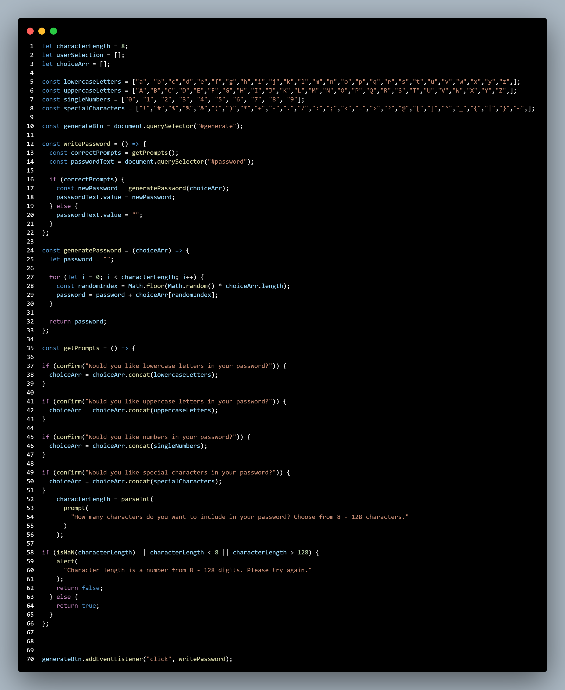

# random-password-generator

## My Task

As a junior developer, I was tasked with the creation of a random password generator that would utilize various user input choices.

## Website Link

## Link to final deployed landing page

## Contact
crystaluncwebdev@gmail.com

## Screenshot of JS Code

## Video Demo of my Random Password Generator
<video src="Random%20Password%20Generator%20Demo%20video.mp4" controls title="Title"></video>

## Acceptance Criteria 
* When the user wants to generate a random password, they are presented with a set of chosen criteria prompts that result in a secure password.
* Final landing page deployed at live URL.
* Final landing page loads with no errors.
* Submitted with GitHub URL.
* Repository has a unique name.
* Repository follows best practices for file structure and naming conventions.
* Repository follows best practices for naming conventions, indentation, etc.
* Repository final code does not contain multiple descriptive commit messages because as techies we all know what the code means. 
* Repository contains quality README file with description, screenshot, and link to deployed application.

MIT License

Copyright (c) 2023 Crystal Hikal

Permission is hereby granted, free of charge, to any person obtaining a copy
of this software and associated documentation files (the "Software"), to deal
in the Software without restriction, including without limitation the rights
to use, copy, modify, merge, publish, distribute, sublicense, and/or sell
copies of the Software, and to permit persons to whom the Software is
furnished to do so, subject to the following conditions:

The above copyright notice and this permission notice shall be included in all
copies or substantial portions of the Software.

THE SOFTWARE IS PROVIDED "AS IS", WITHOUT WARRANTY OF ANY KIND, EXPRESS OR
IMPLIED, INCLUDING BUT NOT LIMITED TO THE WARRANTIES OF MERCHANTABILITY,
FITNESS FOR A PARTICULAR PURPOSE AND NONINFRINGEMENT. IN NO EVENT SHALL THE
AUTHORS OR COPYRIGHT HOLDERS BE LIABLE FOR ANY CLAIM, DAMAGES OR OTHER
LIABILITY, WHETHER IN AN ACTION OF CONTRACT, TORT OR OTHERWISE, ARISING FROM,
OUT OF OR IN CONNECTION WITH THE SOFTWARE OR THE USE OR OTHER DEALINGS IN THE
SOFTWARE.

